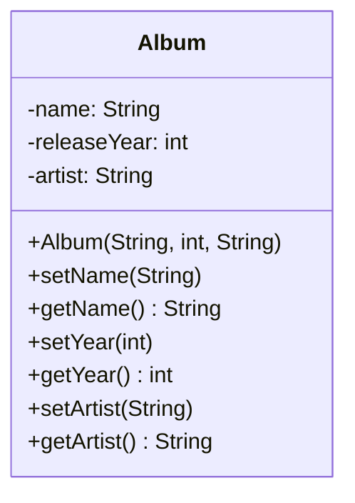
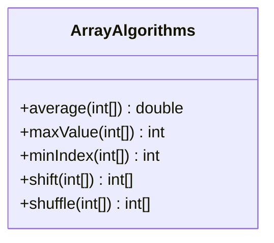

# Assignment 1

## Java Programming
The first assignment is about fundamental Java Programming, but from an object oriented point of view. You will work with sequence, selection, iteration as well as arrays but you will do so in an object oriented fashion. The next assignment will continue the object oriented path even further, but this first one will introduce the basics.

Assignment one should be _one_ gradle project, all classes should be in the `assignmentone` package. See instructions on Moodle for how to set this up.

> Carefully read the assignment rules as defined on Moodle. In brief, do the assignments yourself, hand them in at the deadline and don't cheat.
>
> Do not hesitate to ask your teaching assistant at the practical meetings (or the teacher at the lectures) if you have any problems. You can also post a question in the Slack channel for the course.
>
> **Submission:** you submit your solution using git and GitLab following the instructions given for the course.

### Grading
The assignment is divided into 3 steps (E, C, A). The first part is mandatory and gives the passing grade E. If you pass the automatic test cases for this part you get the E grade.  

The **C** part is optional and can give the grade C or D. The D will be given if the quality of code and comments are lacking.

The **A** part is optional and can (in combination with the C part) give the grade B or A. The B grade will be given if the quality of code and comments are lacking.


### Automatic Testing and Working Process
To aid you in your quest for knowledge you have automatic test cases in the `app/src/test/java/assignmentone` folder. In the folder you find one file for each task: e.g. `HelloThereTest.java`. In each file you find a test class and one or several test methods (i.e. test cases). These show how you can call the respective methods on each class, example input and what the expected output should be.  

From the start all tests are commented out and the working process would be to decomment one test case, run the test (it will fail, or not even compile as the class/method has not even been created buy you yet) and then you make the implementation, and **commit** the code. You repeat this until all test cases are passing the respective task. If you feel that it is helpful you may create additional test cases. This means you should have as many commits as there are test cases.

To run a test the easiest would be to run it from you respective IDE (e.g. in VSCode by pressing the little green "play" button in the left margin for the test, not the one in the right corner for the Java project). Tests can also be run by using gradle in the console (`./gradlew test`) building the application also runs the tests i.e. `./gradlew build`.

Finally you create your respective implementation in the App class under the respective task method. These are the methods where you show your example use as described in the tasks below. In some cases it is a simple calling of methods and printing some results, in other cases the task requires input from the user through the console.

In addition to the testing of functionality there is also testing of code quality. Code quality is maintained by two plugins to gradle - `Checkstyle` that manages the formatting of the source code files, and `FindBugs` that analyze the code and look for common problems and misstakes. In essence if you have too many quality related issues the build will not pass and you have to fix them. Read the error messages carefully in most cases they are very explanatory. A common issue in the javadoc comments is that " " (space) is not counted as empty space.

Commit often. We want to see organic growth of the assignment, not a big bang with everythign at once.

### Building and Running
We require that all tasks build and run using gradle. Do this regularely (i.e. before every commit)

build using: `./gradlew build`  
run using: `./gradlew run -q --console=plain`

## Grade E
### Hello there

Write a class named `HelloThere` that has a single method called `hello` which takes one string as parameter and returns a new string. The returned string should be **Hello there,** followed by the name provided. See below for an example execution:

```
Name, please: Grevious
Hello there, Grevious
```

### Seconds

Create a class called `Time` that has a single method named `toSeconds` that takes three integers as parameters, one for hours, one for minutes and one for seconds. The returned value should be another integer that holds the number of seconds that the hours, minutes and seconds becomes in total. In the main method, call the the method after asking the user for the three numbers (all in one line). See below for an example execution:

```
Enter hours, minutes and seconds: 2 46 39
In only seconds that is: 9999
```

### I'm in a band

For this task, you need to create a complete class for storing an album. Call the class `Album` and implement the attributes and methods as shown in the UML class below. Notice that is should only have _one_ constructor (which sets all attributes), it should guard all attributes from improper use and you need to show that it works in the main method. Improper use in this case means that a name (string) cannot be less than four characters and the year cannot be before 1800 and not after 2029. For now, it is okay to set the name to "No name", artist to "No artist", and year to -1 if the values are wrong or null (later on, we will work with exceptions).



An example run of the application does not need to take any input, but should print out something:

```
Wish You Were Here was released in 1975 by Pink Floyd
```

### Best albums ever

Here we are going to reuse the Album class above. In a new class called `AlbumGenerator` with a single method named `generateAlbums` with no parameters but that creates and returns an array of four albums (objects of the class `Album`). An added problem here is that the class `Album` does not have an empty constructor, so creating an array will be a bit more problematic than usual. The albums themselves can be hardcoded in the method. In the main method, call and print out the albums. An example execution is shown below:

```
Dark Side of the Moon was released in 1973 by Pink Floyd
Wish You Were Here was released in 1975 by Pink Floyd
Animals was released in 1977 by Pink Floyd
The Wall was released in 1979 by Pink Floyd
```

### Working with arrays

In this task, you are going to create a class for working with arrays. Just as with any programming language today, there are quite a lot of helper methods available in libraries for this, but we want you to use **iterations manually** instead of searching for libraries to do it for you. This is an exercise in problem solving. 



Most of the methods should be fairly easy to understand. All of them take an array of integers as parameter. `average()` returns the average value of all the containing integers, `maxValue()` should return the largest value in the array while `minIndex()` returns the index number of the element that is the smallest. `shift()` will shift all elements to the left, meaning that the element that is first before the call should be put last in the array. `shuffle()` uses `Random` to change places of the elements in the array. The two last methods should return the modified array even if that, strictly speaking, isn't necessary (why?), but this way of doing it is _semantically_ more correct.

As with the previous tasks, show that your methods work and do what they should. See below for an example execution:

```
5 2 6 4 1 3 7 9 8 
Average is: 5.0
Largest value is: 9
Index of smallest value is at position: 4
Shifted array: 
2 6 4 1 3 7 9 8 5 
Shuffled array: 
7 8 6 4 1 5 2 9 3 
```

## Grade C
Do not forget to decomment the test cases for this task. They also show the correct names of methods etc. It can be a good idea to decomment parts of the test case and work step by step.

### Calculator
Write a class named 'Calculator'. This class should have methods for addition, subtraction, multiplication, and division. Each method should take two double parameters and return the result.

Division is as you may know special as division by 0 is an illegal operation. This must be handled, add a method that returns true or false if division by zero has been attempted when divide was last called.

In the in the grade C calculator method, ask the user to input two numbers, and then ask them to select an operation (add, subtract, multiply, divide). Based on their selection, call the appropriate method and print the result.


### 2D arrays
Add functionality to the 'ArrayAlgorithms' class to work with 2D arrays. Add the following methods:

- `sum(int[][]): int` that returns the sum of all elements in the 2D array.
- `transpose(int[][]): int[][]` that returns the transpose of the given 2D array. If the input is not a square matrix the return value should be handled according to the test case.

- `diagonalSum(int[][]): int` that returns the sum of the diagonal elements in the 2D array. If the input is not a square matrix the return value should be handled according to the test case.


### Band
Create a class named 'Band'. This class should have attributes for the band name, year formed, and an array of Album objects. Include methods for adding new albums (given the album name and year), getting the band's total discography, and finding the oldest album.

Check the test cases for exact method names, arguments and return types.

#### Findbugs warning
When returning the album objects of a band you may get a warning from findbugs (It depends on version of Findbugs). We will ignore this at this point. This is the warning you may get:

```
May expose internal representation by returning reference to mutable object (EI_EXPOSE_REP)

Returning a reference to a mutable object value stored in one of the object's fields exposes the internal representation of the object.  If instances are accessed by untrusted code, and unchecked changes to the mutable object would compromise security or other important properties, you will need to do something different. Returning a new copy of the object is better approach in many situations.
```

Why do you think you may get this warning for reurning a Band's Album objects and not e.g. the Band name?

Can you find anything problematic with the methods in Album in this new context where an Album belongs to a Band object? How would you handle this problem?

Use the readme.md file to document your thoughts.


## Grade A

### Advanced Calculator

Add functionality to the 'Calculator' class to include methods for calculating the square, square root, and factorial of a number. Each method should take one parameter and return the result. In the GradeA calculator method, ask the user to input a number, and then ask them to select an operation (square, square root, factorial in addition to the grade C methods). Based on their selection, call the appropriate method and print the result. For the square root it is fine to use the` Math.sqrt()` method. A challenge is to implement your own.

### 3D Arrays
Add functionality to the 'ArrayAlgorithms' class to work with 3D arrays. Add the following methods:

- `sum(int[][][]): int` that returns the sum of all elements in the 3D array.
- `maxValue(int[][][]): int` that returns the maximum value in the 3D array.
- `minValue(int[][][]): int` that returns the minimum value in the 3D array.

### Music Genre
Add functionality to the 'Album' class to include a genre attribute. Add methods to set and get the genre. In the Band class, add a method to list all albums of a particular genre.